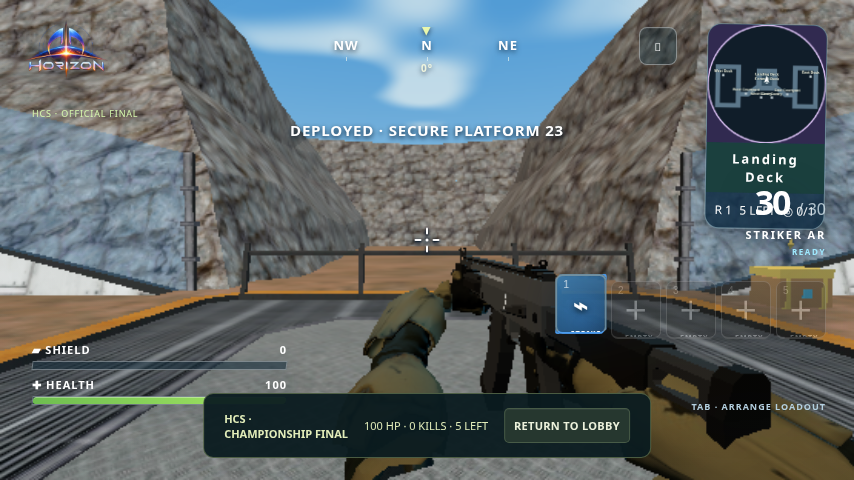
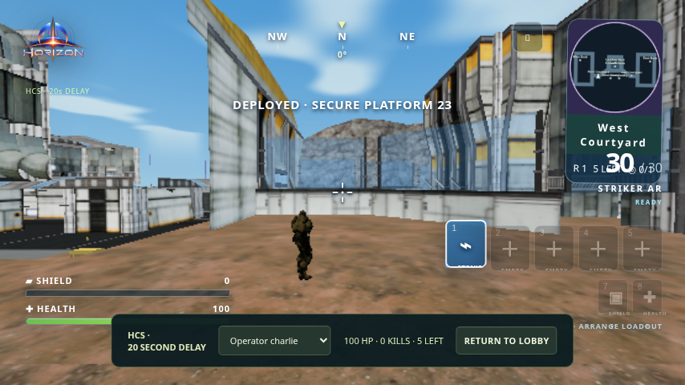
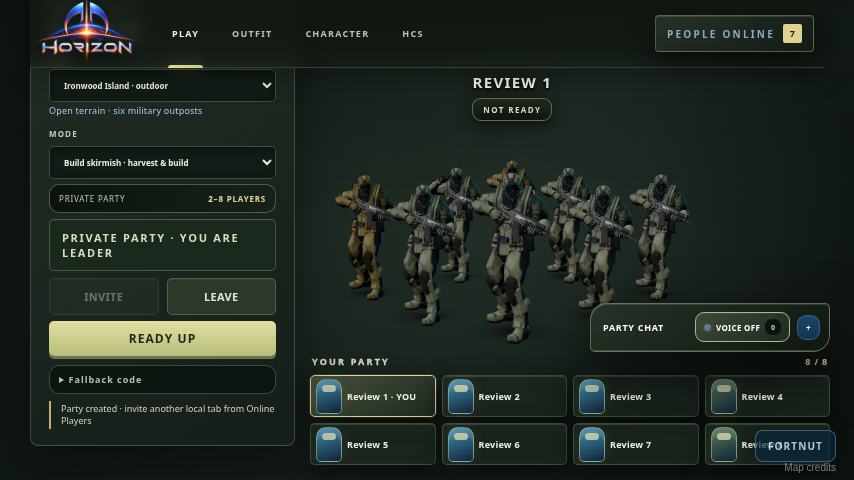
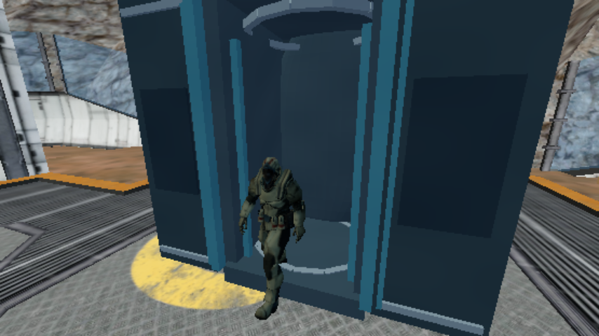
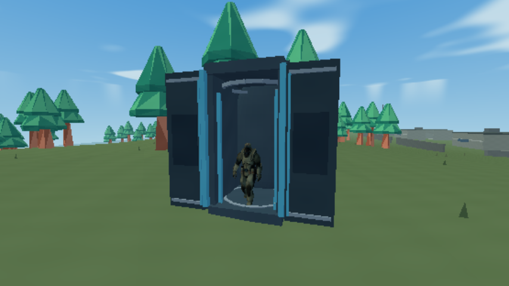

# HCS and maximum-player review — 10 October 2026

Reviewed game commit `9b6bcbc`. **No gameplay, renderer, map, weapon or server code was changed.** This commit adds review scripts, actual screenshots and test reports only.

## What ran

| Scenario | Clients and transport | Result |
|---|---|---|
| HCS deployment and spectating | Five rendered competitors, three rendered spectators, twelve additional spectator WebSockets: five competitors + fifteen spectators total | All five reached gameplay; all five spectator selections rendered; first-person competitors and third-person spectators confirmed |
| HCS combat and champion | Five authenticated test player WebSockets + spectator; controlled supported-floor positions; actual native firing inputs | 16 shots, four eliminations, last-survivor champion and delayed final delivery confirmed; no injected scores/elimination events |
| Normal Platform 23 / Town Royale | Eight connected browser tabs, all render loops enabled, local BroadcastChannel | Lobby, eight pod reservations, landing, weapon switching, scope and an actual AR shot completed |
| Normal Ironwood / Build Skirmish | Eight connected browser tabs, all render loops enabled, local BroadcastChannel | Initial facility-to-island run timed out at the exact `pod_opening` checkpoint. Island-only recheck with a broader landing checkpoint completed |
| Automated suite | Existing simulation, collision, weapon, grip, audio, deployment and HCS tests | **459 passed, zero failed**; focused HCS run: 37 passed |
| Referee timing | Five-player native simulation, 600 ticks, target 30Hz | Median 0.99ms, p95 8.46ms, maximum 42.52ms; one observed peak exceeded the 33.33ms tick budget |
| Weapon captures | One rendered client; controlled native snapshots at correct magazine capacities | Separate close views for every base weapon and variant; see capture report |

These are automated local tests, not twenty human players on the public deployment. Supabase authentication was replaced with test identities; the HCS HTTP/WebSocket service, match simulation, map and renderer were real. Normal matches used local BroadcastChannel, not Supabase's public transport. Normal pod entry was automated through native `chooseLanding`/`enterPod`; walking to every pod and selecting it manually was not tested here. Controlled weapon loadouts were injected by test code, not obtained from natural chest drops.

## Findings — left unfixed

1. **Severe stalls in the multi-client rendering workload.** Chromium used SwiftShader software rendering at low quality, 854×480. HCS rendered clients recorded median frame intervals around 550–617ms (roughly 1.6–1.8 FPS), with longer pauses. Eight normal tabs showed background clients near one frame per second; the last active tab measured about 10 FPS on Platform 23 and 15 FPS outdoors. GPU emulation, shared CPU contention and browser background-tab scheduling affect these figures. They do not establish real GPU performance, but this review cannot call the workload lag-free.
2. **Compact HUD overlap.** At 854×480, weapon/ammo information overlaps the lower minimap area. It is visible in the HCS player and normal shotgun screenshots. Normal match instructions/chat also occupy considerable screen space at this resolution.
3. **Unresolved initial outdoor checkpoint timeout.** The first facility-to-island run waited 150 seconds for exactly `pod_opening` and failed. An island-only recheck reached pod opening, exiting, saluting and gameplay. The recheck changed the checkpoint to accept later landing stages as well; therefore it does not prove that the original map-switching/strict-timing scenario is fixed. Keep this as a follow-up, not a clean pass.
4. **Spectator bandwidth needs production measurement.** Each of the twelve measured spectator connections received 2,871 snapshots and approximately 21.9MiB. That is roughly 7.8KiB per snapshot, or about 235KiB/s per viewer at 30Hz before transport overhead. More spectators increase outbound traffic even if they send no gameplay inputs. Check Northflank resource and transfer limits before a public tournament.
5. **Normal reload was not conclusively verified under rendering load.** The harness pressed R, but the retained events did not confirm an accepted reload. AR shots and a corresponding sampled sound were confirmed. Treat reload responsiveness as incomplete coverage, not a proven product defect.

No JavaScript page errors or captured WebGL/shader errors were recorded in the completed browser scenarios. All recorded landing coordinates were finite; the HCS players landed on their five distinct native pads. No missing ground or obviously warped bodies appeared in the inspected screenshots. That is limited visual coverage, not proof that every corridor, collision surface or finger pose is flawless. Damaging combat was verified in the separate HCS fixture, not in the idle multi-window landing/spectating workload.

The minimum matched spectator delay measured **20,001ms**. Spectators received the delayed feed and could select each competitor. The public champion and final state remained delayed in the combat check.

## Screenshots

These are real browser captures, not generated previews.

### HCS competitor



### HCS spectator



### Eight-player lobby



### Pod walkouts on both maps





### Weapon close views — base models and variants

| Family | Base | Variant |
|---|---|---|
| AR | [Striker](weapon-ar.png) | [Sentinel](weapon-ar_sentinel.png) |
| Shotgun | [Thunder](weapon-shotgun.png) | [Breacher Auto](weapon-shotgun_breacher.png) |
| SMG | [Raptor](weapon-smg.png) | [Viper](weapon-smg_viper.png) |
| Sniper | [Eagle-Eye](weapon-sniper.png) | [Longbow](weapon-sniper_longbow.png) |

These medium-quality 1280×720 views use the separate single-client fixture, not the simultaneous stress workload.

### Other captures

- [HCS check-in](hcs-qualified.png) · [mobile broadcast](hcs-mobile-broadcast.png)
- Spectator selections: [Alpha](hcs-view-alpha.png), [Bravo](hcs-view-bravo.png), [Charlie](hcs-view-charlie.png), [Delta](hcs-view-delta.png), [Echo](hcs-view-echo.png)
- Platform 23: [AR](normal-facility-ar.png), [shotgun](normal-facility-shotgun.png), [SMG](normal-facility-smg.png), [sniper](normal-facility-sniper.png), [scope](normal-facility-sniper-scope.png), [shooting](normal-facility-combat.png)
- Ironwood: [AR](normal-island-ar.png), [shotgun](normal-island-shotgun.png), [SMG](normal-island-smg.png), [sniper](normal-island-sniper.png), [scope](normal-island-sniper-scope.png), [shooting](normal-island-combat.png)

The normal multi-client Sentinel captures used a generic 30-round fixture despite its 24-round magazine. That display is a test-fixture artifact, not a discovered live ammo bug. Use the separate `weapon-ar_sentinel.png` capture for its correct magazine presentation.

## Evidence and reproduction

- [HCS load metrics and landing positions](hcs-load-results.json)
- [Controlled HCS combat](hcs-combat-results.json)
- [Normal Platform 23 measurements](normal-max-results.json)
- [Outdoor recheck and recorded stages](normal-outdoor-recheck.json)
- [Initial timeout output](normal-initial-run.txt)
- [Referee timings](referee-performance.json)
- [Test summary](test-summary.json)
- [Weapon capture fixture](weapon-capture-results.json)

Start the existing development server on port 4173. Run the review scripts separately to avoid overlapping renderer stress loads:

```sh
node scripts/hcs-review-load.mjs
node scripts/hcs-combat-review.mjs
node scripts/normal-max-review.mjs
REVIEW_MAPS=island node scripts/normal-max-review.mjs
node scripts/weapon-review-captures.mjs
npm test
```

Real devices with hardware acceleration, actual internet conditions, the live Supabase identity/party flow, Northflank free-tier CPU/memory/transfer limits, a public tournament dress rehearsal and long-duration reconnect testing remain outside this local review.
