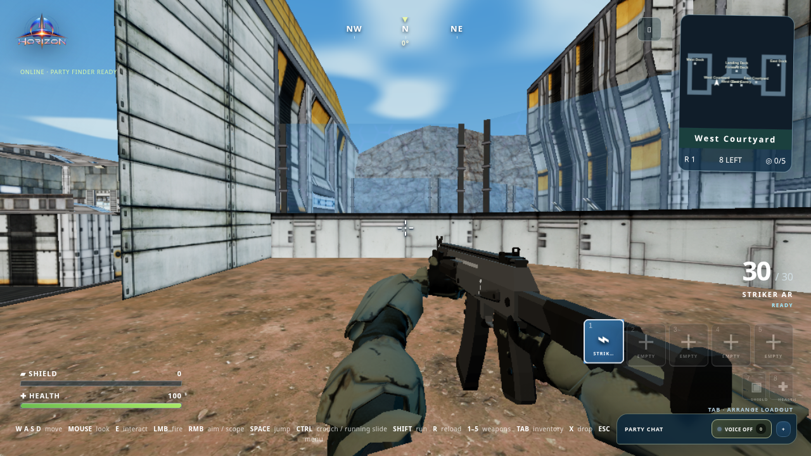
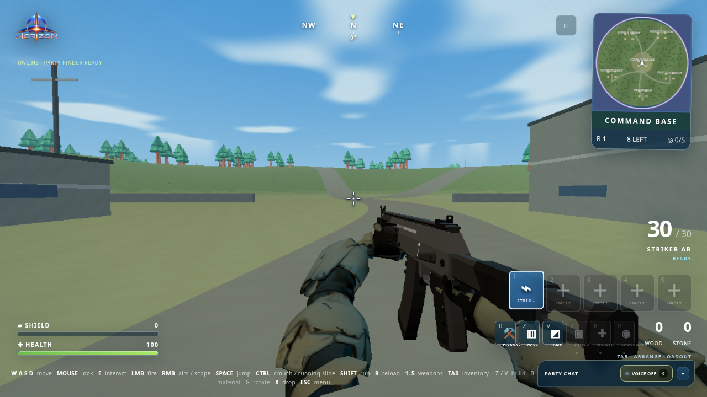
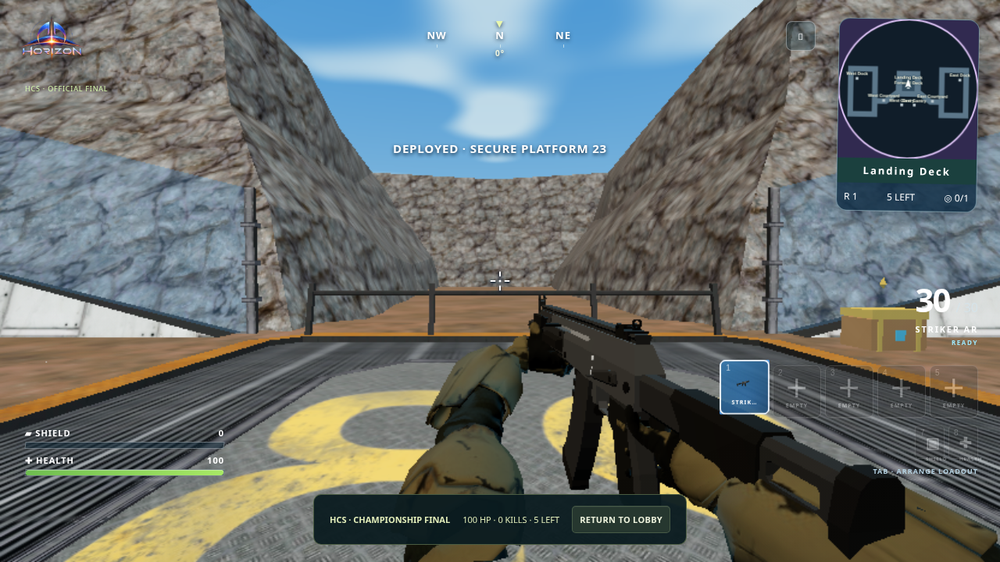
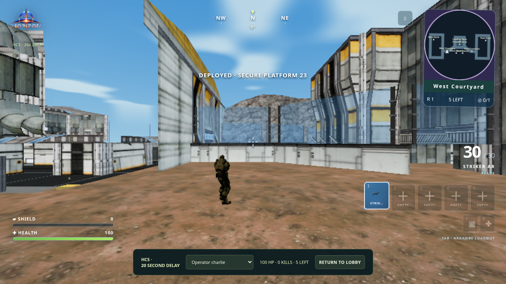
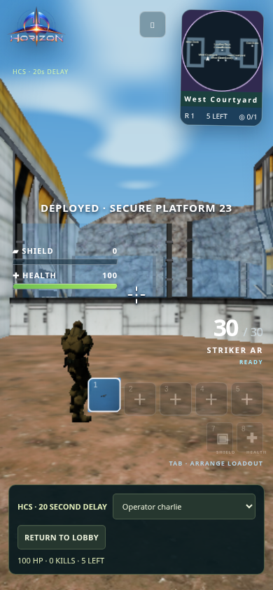
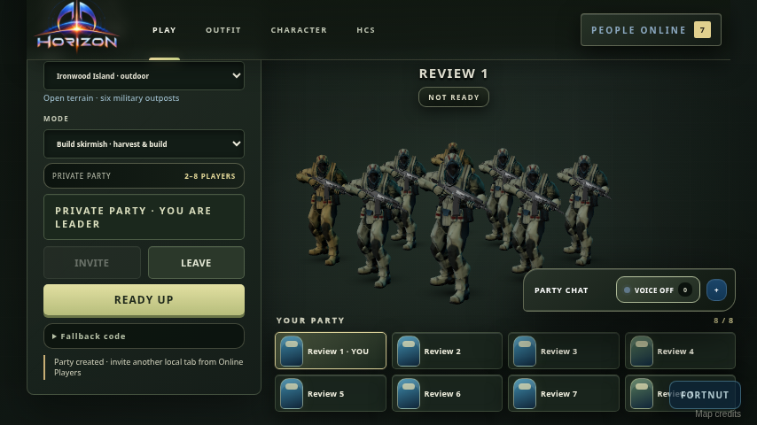

# Performance and glitch fixes — 10 October 2026

Follow-up to the [HCS and maximum-player review](../hcs-2026-10-10/README.md). This change fixes the reproducible issues found in that review and adds stricter checks and fresh browser captures.

## Changes

- **Character work:** camera-frustum checks now happen before offscreen animation, grip IK and skinned drawing. Conservative bounds include extended arms, weapons and salutes. Turning back toward an actor restores its model and shadow; native rig tests check this.
- **Rendering budgets:** quality presets cap total render pixels on retina and ultrawide displays. Existing ordinary-resolution output and map textures remain intact. Hidden tabs and the opaque HCS lobby panel suspend GPU work and resume when visible; networking continues separately.
- **HCS spectators:** broadcast updates run at 10Hz instead of 30Hz, with existing client interpolation. Competitors and authoritative simulation remain at 30Hz, and the delayed feed retains its full 20-second buffer. Identical snapshots are encoded once per audience instead of once per recipient. Normal server matches use one shared frame identifier per tick for all competitors.
- **Local matches:** eight-player BroadcastChannel inputs now run every 33ms instead of inheriting Supabase's 1,250ms free-tier quota cadence. Hosted Supabase fallback limits remain unchanged; configured online qualifying matches use the existing WebSocket referee.
- **Simulation recovery:** delayed local-host callbacks catch up in bounded, collision-safe steps instead of discarding most elapsed time. Scripted deployment continues to follow its music/wall clock.
- **False disconnects:** the loaded-map test exposed connected players being eliminated before queued heartbeats arrived. The party retains its roster during a six-second timeout verification window, probes silent peers, and gives the message queue a recovery window after long event-loop stalls. Explicit leave/disconnect messages still take effect immediately.
- **Reload taps:** a shot and subsequent R tap merged into one delayed input packet now fire the queued bullet before starting a full-magazine reload. Previously that reload request was lost.
- **HUD:** compact minimaps, ammo, health, inventory and spectator controls no longer overlap in the tested layouts. Weapon-slot labels fit their cards instead of being clipped.

## Verification

| Scenario | Result |
|---|---|
| Full eight-renderer normal match, Platform 23 → Ironwood | Both maps completed in one run; all eight native players had 100 HP immediately after deployment; five weapon selections, scope, actual shots, accepted AR reload and completed refill verified on each map |
| Eight authenticated normal WebSocket competitors | Both maps deliver shared authoritative frames to all eight recipients; connections stay open and all eight actors appear in snapshots |
| HCS load: five rendered competitors, three rendered spectators, twelve extra spectator sockets | Five competitors and fifteen spectators total; deployment, five selectable spectator targets and return to lobby completed; no captured JavaScript/WebGL errors; measured minimum delay **20,000ms** |
| HCS combat | Actual authenticated firing inputs produced four eliminations and the last-survivor champion; final delivery remained delayed |
| Fresh HCS layout run | One rendered competitor + four competitor sockets, plus a rendered spectator; all five native players survive deployment; first-person competitor and third-person spectator; desktop and phone captures |
| HUD bounds | Build, gunfight and HCS layouts at 1280×720, 854×480, 390×844 and 667×375 pass overlap, viewport and label bounds checks |
| Hidden rendering | Zero measured WebGL draws behind the HCS panel and while hidden; Play/foreground resume without a lost graphics context |

The automated suite passes **471 tests, zero failures**, and the production build passes. It also covers native grips/fingers, weapon assets and variants, movement, collision/support, chest opening, inventory, deployment/music, outfits and HCS rules. See [checks](checks.json).

The earlier exact `pod_opening` wait could miss that brief stage at very low frame rates. The review harness now accepts later landing stages while still requiring completed deployment and native player survival. Another harness precondition was corrected: Ironwood initially equips slot 0, while Platform 23 initially equips slot 1. These are test corrections, not changes to map rules.

## Measured performance and limits

In the controlled single-browser, eight-actor test with seven actors behind the camera, average character-update work fell approximately **97–98%**. Median frame intervals improved from **83.3ms to 50.1ms outdoors**, and **266.6ms to 249.9ms on Platform 23**. This specific fixture measures offscreen savings, not an all-visible crowd. [Before](render-before.json) and [after](render-after.json) include timings, pixels, renderer statistics and CPU samples.

HCS spectator snapshot cadence is reduced by **67%**. The load run measured 895 snapshots / 7,159,654 payload bytes per extra spectator; run duration differs from the original review, so raw totals should not be treated as a normalized bandwidth comparison. The 20-second delay was measured against matching authoritative snapshots, not inferred from the UI label.

The environment uses **Chromium SwiftShader software rendering**, not a hardware GPU. Eight simultaneous renderers still stall: HCS median frame intervals were approximately 533–550ms, and normal background tabs were near one frame per second. The normal foreground tab measured 50ms on both maps, with larger pauses. These changes do **not** establish lag-free gameplay on every device. Brief cinematic stages can still be missed visually at extremely low frame rates. See the complete [HCS metrics](hcs-load-results.json), [normal metrics](normal-max-results.json) and [referee timings](referee-performance.json).

These are local automated tests, with test identities replacing Supabase authentication. Normal rendered matches use BroadcastChannel; the separate eight-client test uses real local WebSockets. Test-only weapon loadouts and supported-floor combat fixtures are labeled in the scripts. Live Northflank/Supabase traffic, internet latency and real hardware GPU performance were not verified here. No new textures or weapon/character meshes were substituted to obtain these measurements.

## Actual screenshots

### Maps at medium quality





### Current HCS views







### Eight-player normal deployment



[Platform 23 landing](normal-facility-pod-landing.png) · [Ironwood landing](normal-island-pod-landing.png)

## Reproduction

Start `PORT=4173 npm run dev`, then run browser workloads separately:

```sh
npm run check
GAME_ARTIFACTS=/tmp/normal-review node scripts/normal-max-review.mjs
GAME_ARTIFACTS=/tmp/hcs-load node scripts/hcs-review-load.mjs
GAME_ARTIFACTS=/tmp/hcs-layout node scripts/hcs-live-browser-check.mjs
GAME_ARTIFACTS=/tmp/hcs-combat node scripts/hcs-combat-review.mjs
GAME_ARTIFACTS=/tmp/render-profile node scripts/render-performance-check.mjs
GAME_ARTIFACTS=/tmp/hud-layout node scripts/compact-hud-check.mjs
node scripts/graphics-idle-check.mjs
node scripts/hcs-performance-check.mjs
```
